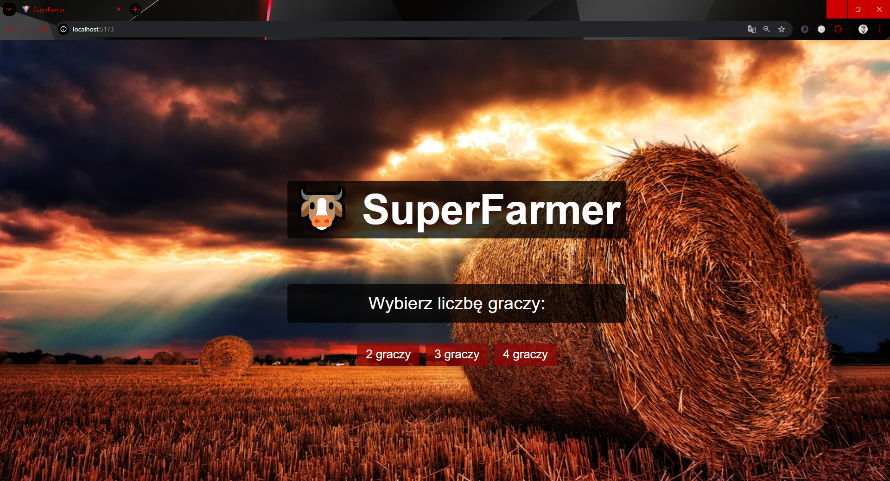
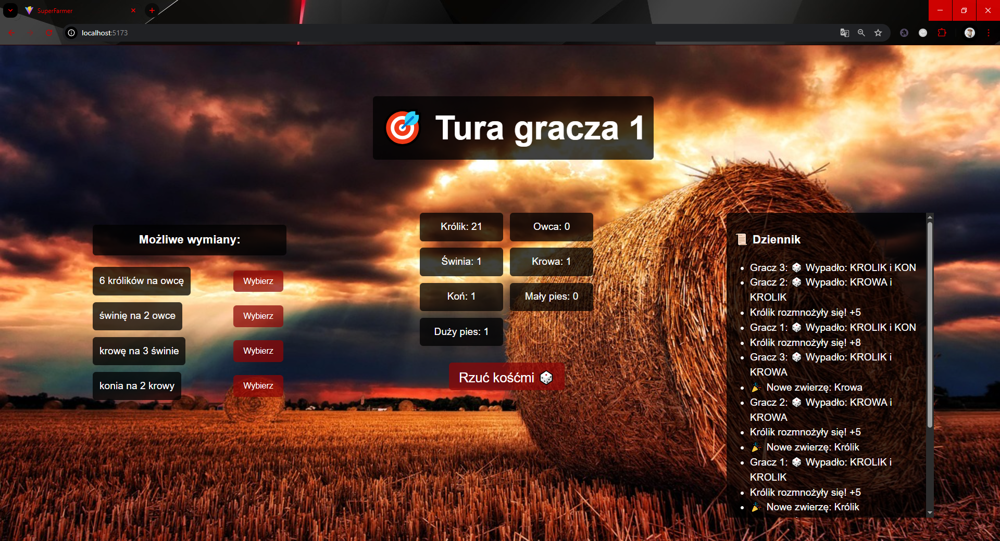
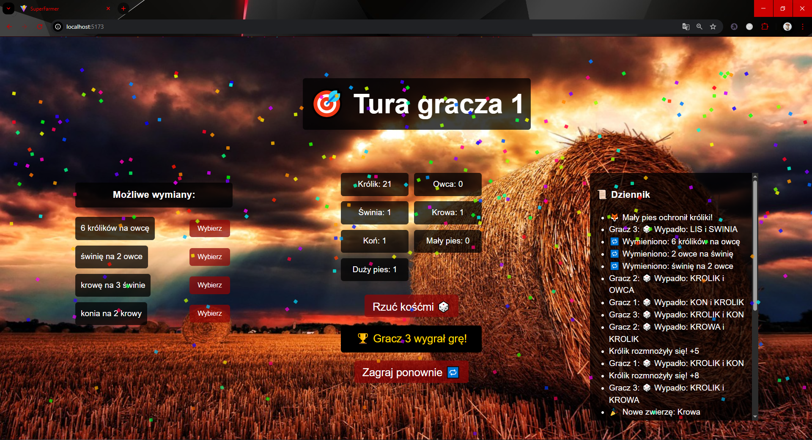

# 🐮 SuperFarmer – gra przeglądarkowa

SuperFarmer to przeglądarkowa wersja kultowej gry planszowej, w której zarządzasz własnym gospodarstwem. Hoduj zwierzęta, wymieniaj je i chroń przed lisami i wilkami. Graj sam lub z przyjaciółmi w trybie lokalnym!

## 🎮 Funkcje

- 🔄 Tury dla 2–4 graczy
- 🐰 System losowania zwierząt z ryzykiem ataku lisa lub wilka
- ♻️ Inteligentny system wymiany zwierząt
- 🏆 Warunki zwycięstwa z efektem konfetti
- 📜 Log zdarzeń z ostatnich ruchów

## 🧱 Technologie

- ⚡ [Vite](https://vitejs.dev/) – super szybki bundler
- ⚛️ React + TypeScript – interfejs użytkownika i logika gry
- 🎨 CSS – stylizacja elementów i animacje

## 🚀 Jak odpalić projekt

```bash
  cd superfarmer
  npm install
  npm run dev
```
Wejdź w przeglądarce na adres:

http://localhost:5173

## 🐮 Ekran startowy gry SuperFarmer

Po uruchomieniu aplikacji użytkownik trafia na klimatyczny ekran główny oraz tytuł **SuperFarmer**.

Poniżej znajduje się panel wyboru liczby graczy — do wyboru są opcje:

- `2 graczy`
- `3 graczy`
- `4 graczy`

Kliknięcie jednej z nich rozpoczyna rozgrywkę. 



## 🎯 Ekran rozgrywki – tura gracza

Po wyborze liczby graczy rozpoczyna się właściwa rozgrywka. Interfejs tury zawiera:

- **Nagłówek** z aktualnym numerem gracza.
- **Panel możliwych wymian** po lewej stronie – gracz może zamieniać zwierzęta według ustalonych reguł, klikając przycisk `Wybierz`.
- **Stan gospodarstwa** na środku – pokazuje aktualną liczbę posiadanych zwierząt.
- **Przycisk `Rzuć kośćmi 🎲`**, który aktywuje losowanie dwóch zwierząt i ewentualne zdarzenia specjalne (np. atak wilka lub lisa).
- **Dziennik gry** po prawej – rejestruje każdy ruch, rzuty kośćmi, rozmnożenia, wymiany oraz inne ważne zdarzenia w grze.



## 🏆 Zwycięstwo

Aby wygrać grę **SuperFarmer**, gracz musi zebrać następujące zwierzęta:

- 🐇 1 Królik
- 🐑 1 Owca
- 🐖 1 Świnia
- 🐄 1 Krowa
- 🐎 1 Koń

Po spełnieniu tych warunków:

- Na ekranie pojawia się **komunikat o zwycięstwie**, np. `🏆 Gracz 3 wygrał grę!`
- Z nieba zaczyna **spadać konfetti** w losowych kolorach i animacjach
- Pojawia się przycisk **„Zagraj ponownie 🔁”**, który po kliknięciu **przenosi gracza z powrotem na ekran startowy**, gdzie można wybrać nową liczbę graczy i rozpocząć kolejną rozgrywkę.

